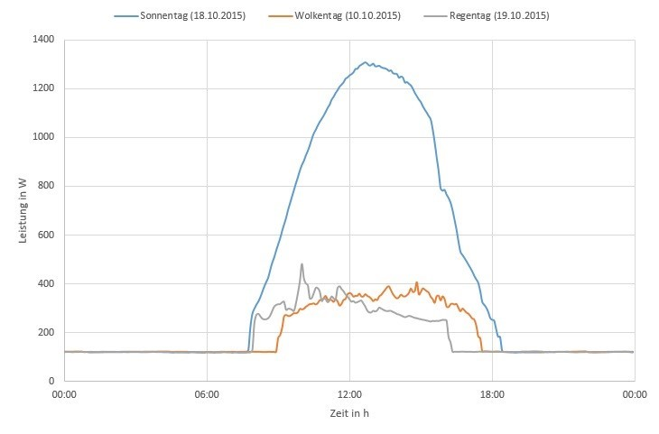

# Photovoltaik

## Inhalt
[Motivation und Nutzen](#Motivation-und-Nutzen)

[Technik und Funktion](#Technik-und-Funktion)

[Arten von Photovoltaik-Modulen](#Arten-von-Photovoltaik-Modulen)

[Wechselrichter](#Wechselrichter)

[gemessene Daten](#gemessene-Daten)

[Leistung](#Leistung)

[Parameter](#Parameter)

[Fehler und deren Auswirkung](#Fehler-und-deren-Auswirkung)

[Defekt-Erkennung](#Defekt-Erkennung)

[Leistungs-Zeit Kurve](#Leistungs-Zeit-Kurve)

[Thermografie](#Thermografie)

[Quellen](#quellen)

## Motivation und Nutzen
Das grundlegende Ziel dieses Projektes ist die Fehlererkennung an PV-Modulen. Damit bildet die Photovoltaik Technik einen grundlegenden Bestandteil des Projektes. Das Verständnis, was eine PV-Anlage ist, woraus sie aufgebaut ist und vor allem was ein PV-Modul ist und wie es funktioniert, muss bei allen Team-Mitgliedern vorliegen. Aus diesem Grund wird das Thema Photovoltaik an dieser Stelle genauer beleuchtet. Außerdem wird ein kleiner Ausblick auf weiterführende Themen gegeben.

Die Solartechnik existiert bereits seit 1953 und wurde in den Bell Laboratories entwickelt. Photovoltaik-Anlagen haben in der Vergangenheit immer mehr Bedeutung erlangt. Energiewende, erneuerbare Energien und grüner Strom sind nur einige der Begriffe, die überall zu hören sind. 
Laut Fraunhofer Institut leisten PV-Anlagen einen wichtigen Beitrag zum Klimaschutz. Insbesondere durch relevante Beiträge zur Senkung des CO2-Ausstoßes. Dies berücksichtigt auch die Herstellung und Entsorgung der Anlage, da während des Betriebs kein CO2 ausgestoßen wird [WIRTH21]. Je länger eine PV-Anlage wirtschaftlich arbeiten kann, desto besser sind also die Auswirkungen auf die Umwelt, neben der Ersparnis, die Anlage zu erneuern. Um sicher zu stellen, dass PV-Anlagen fehlerfrei (im Rahmen des Möglichen) funktionieren müssen sie regelmäßig gewartet werden. Wartungen sind zeitaufwändig und damit teuer. Gleiches gilt für die Fehlersuche. Wenn diese manuell durchgeführt wird müssen die gesammelten Daten händisch ausgewertet werden. Dafür sind Experten nötig, welche ebenfalls teuer sind.

## Technik und Funktion
Es gibt viele verschiedene Arten von PV-Modulen. Alle grundlegenden Eigenschaften und Gemeinsamkeiten werden im Folgenden beleuchtet. Auf Unterschiede zwischen den einzelnen Modul-Typen wird im Abschnitt [Arten von Photovoltaik-Modulen](#arten-von-photovoltaik-modulen) beschrieben. PV-Module basieren auf Halbleitern. Dies sind Materialien, welche nur unter bestimmten Umständen leitend sind. Für PV-Module wird vorrangig Silicium eingesetzt.
Die Stromerzeugung im Halbleiter basiert auf zwei physikalischen Prozessen. Der Erste ist der *innere Photoeffekt*, bei welchem durch das Auftreffen von Photonen auf der Halbleiterschicht Elektronen aus ihr herausgelöst werden. Dadurch verbleiben im Halbleiter das negativ geladene Elektron und ein positiv geladenes 'Loch'. Da beide frei beweglich sind ist die erste Voraussetzung für den Fluss elektrischen Stromes erfüllt. Allerdings würden sich die Elektronen sehr schnell wieder ein freies Loch sichen, wodurch kein Strom fließen könnte. Das bedeutet, dass diese Wiedervereinigung verhindert werden muss. Hier kommt der Photovoltaische Effekt zum tragen. Dieser wird geziehlt durch den Aufbau des PV-Moduls ermöglicht. In der folgenden Abbildung ist der Aufbau eines PV-Moduls oberflächlich dargestellt.

Eingeschlossen zwischen positiver und negativer Elektrode befindet sich das Halbleitermaterial. Es handelt sich hierbei um Material, in welches Fremdatome eingefügt wurden (Dotierung). In der Praxis sind dies meißt Bor und Phosphor. Das dotierte Halbleitermaterial besteht aus zwei Schichten. eine p-dotierte Lage (in der Abbildung unten) in der ein Überschuss an positiven Löchern vorherrscht und eine n-dotierte Lage (in der Abbildung oben), in welcher sich mehr Elektronen befinden. Zwischen beiden Schichten befindet sich der pn-Übergang. Dieser ist dafür verantwortlich gelöste Elektronen daran zu hindern, sich mit den Löchern wieder zu vereinen. Der Effekt wird mit einem elektrischen Feld erzeugt. Der positive Pol des Feldes zieht die getrennten Elektronen in die n-dotierte Schicht und trennt sie damit von den Löchern, welche in die p-dotierte Schicht verlagert werden. Durch die Grenzschicht ist die direkte Verbindung abgetrennt, damit bleibt nur noch der Weg über den Verbraucher.

Wer sich noch detaillierter in das Thema einarbeiten will hat hier verschiedene Beschreibungen in ~aufsteigender Komplexität zur Verfügung:

- [Planet Wissen](https://www.planet-wissen.de/technik/energie/solarenergie/index.html)
- [Solaranlagen-abc](https://www.solaranlagen-abc.de/funktion-photovoltaik/)
- [Wikipedia](https://de.wikipedia.org/wiki/Photovoltaik)
- [Fraunhofer Institut](https://www.ise.fraunhofer.de/content/dam/ise/de/documents/publications/studies/Photovoltaics-Report.pdf) (PDF)
- [IOP-Science](https://iopscience.iop.org/article/10.1088/1361-6463/ab9c6a/pdf) (PDF)

### Arten von Photovoltaik-Modulen
Es gibt verschiedene Arten von PV-Modulen, welche alle die selben grundlegenden Eigenschaften besityen. Das Trägermaterial aller Module ist Glas. Dieses wird mit den photoaktiven Halbleitern erweitert, welche für die tatsächliche Energieerzeugung verantwortlich sind. Dabei handelt es sich in der regel um Siliciumzellen. Hierauf wird in den folgenden Abschnitten im Detail eingegangen. Ein PV-Modul ist aus vielen einzelnen Zellen aufgebaut, welche zu Strings zusammengeschaltet werden. Zum Schutz vor Fehlern werden einzelne Strings mit Schutzdioden überbrückt. 

Der Wirkungsgrad von PV-Modulen unterscheidet sich stark zwischen den einzelnen Typen. Er hat sich jedoch bei jedem Typ in den letzten 50 Jahren stark verbessert. In der folgenden Übersicht ist der Verlauf des Wirkungsgrades für verschiedene PV-Modul-Typen über die letzten Jahre dargestellt.

Etwas leichter zu lesen sind die aktuellen Werte:

|Zelltyp            |Wirkungsgrad |
|-------------------|-------------|
|monokristallin     |20 - 22 %    |
|polykristallin     |15 - 20 %    |
|amorphes Silicium  |~8 %         |
|CIS-Zellen         |~12 %        |
|GaAS-Zellen        |~25 %        |
|Farbstoffzellen    |2 - 3 %      |

#### Monokristalline Silicium PV-Module
Monokristalline PV-Module werden aus Silicium hergestellt. Dafür wird Silicium geschmolzen und gereinigt. Aus dem geschmolzenen Silicium wird ein einziger Monokristalliner Stab gezogen, welcher ein einheitliches Kristallgitter aufweist. Der Stab wird dann in sehr dünne Scheiben (Wafer) gesägt. Diese sind nur einige Mikrometer dick. Bereits während der Wafer-Herstellung wird das Silicium mit Bor dotiert und chemisch behandelt. Die andere Hälfte der Wafer wird dann mit Phosphor dotiert.
Die Solarzelle wird aus den behandelten und dotierten Wafern aufgebaut. Jede Zelle enthält einen n- und einen p-dotierten Wafer.
Monokristalline PV-Module haben einen hohen Wirkungsgrad, sind dafür aber sehr aufwändig in der Herstellung und dadurch teuer. Hinzukommt, dass die energetische Amortisationsdauer durch die aufwändige Herstellung höher ist.

#### Multikristalline Silicium PV-Module
Genau wie Monokristalline PV-Module bestehen Multi- oder Polykristalline PV-Module aus dem Grundstoff Silicium. Dieses wird bei der Herstellung der Module zunächst gereinigt und dann für die Weiterverarbeitung geschmolzen. Es gibt verschiedene Fertigungsmethoden:
- Gießverfahren: das geschmolzene Silicium wird in Tiegel gegossen und kühlt in diesen ab, wobei sich Kristalle bilden
- Bridgeman-Verfahren: Das Silicium kühlt im selben Tiegel ab, in dem es erhitzt wurde. Es wird dann in Wafer zersägt und weiterverarbeitet

Bei beiden Verfahren entstehen mehrere Kristalle. Die Verfahren sind sehr viel einfacher und günstger als das Herstellen von Monokristallinen Modulen. Das führt zu einem hohen Preis-Leistungs-Verhältnis und zu einem hohen Marktanteil (>80% in Deutschland). Der Wirkungsgrad ist jedoch geringer.

#### Amorphe Silicium PV-Module
Amorphe Solarzellen, oder auch Dünnschicht-PV-Module sind nicht kristallin. Das Material (idR. Silicim) wird bei der Herstellung auf eine Trägerschicht aufgedampft oder aufgedruckt. Dadurch entsteht eine nicht-kristalline Schicht, so wie in der folgenden Abbildung dargestellt.

Amorphe PV-Module sind materialsparend und günstig. Dies kann durch den hohen Absorbtionsgrad des Halbleitermaterials erziehlt werden. Sie können in sehr dünnen Schichten effizient Energie erzeugen.
Ein weiterer Vorteil der dicke ist die Formbarkeit der PV-Module. Sie ermöglicht viele neue Anwendungsbereiche, wie aufrollbare oder mobile PV-Module. Der Wirkungsgrad von Amorphen PV-Modulen ist allerdings gering. Dafür können Sie sehr gut mit Verschattungen umgehen. 

#### Mikromorphe Silicium PV-Module
Das Ziel Mikromorpher PV-Module ist es, einen höheren Wirkungsgrad zu erziehlen, als mit Amorphen Silicium Modulen. Bei dieser Technik werden Zellen mit Silizium unterschiedlicher Struktur hintereinander geschaltet. Die Kombination einer amorphen mit einer mikrokristallinen Zelle wird als mikromorphe Zelle bezeichnet. Die mikromorphe Zelle ist eine Weiterentwicklung und Optimierung der Tandemzelle aus amorphem Silizium. [photovoltaik-web.de](https://www.photovoltaik-web.de/photovoltaik/module)

#### CdTe PV-Module 

CdTe Solarzellen (cadmium telluride) sind eine vielgenutzte Alternativen zu Silizium-Modulen. Sie sind sehr dünn und können einfach und günstig produziert werden. mit ca. 22% Wirkungsgrad sind sie sehr effektiv. Ein weiterer positiver Aspekt der Zelle ist der hohe Absorbtionsgrad des Materials.
Die meisten CdTe Solarzellen bestehen aus einem pn-Übergang mit einem p-dotierten CdTe-Layer und einem n-dotierten CdS- (Cadmium Sulfid) oder MZO- (Magnesium Zinkoxid) Layer. Typische CdTe-Dünnschichtabscheidungstechniken sind die Dampftransportabscheidung und die Sublimation. CdTe-Absorberschichten werden in der Regel auf einer transparenten leitfähigen Oxidschicht (TCO) aufgebracht - in der Regel fluordotiertes Zinnoxid (SnO2:F). Die Zellen werden mit einem elektrischen Rückseitenkontakt vervollständigt - typischerweise eine Schicht aus Zink-Tellurid (ZnTe), gefolgt von einer Metallschicht oder einer Kohlenstoffpaste, die auch Kupfer (Cu) in die Rückseite der Zelle einbringt.

#### CIGS PV-Module
Kupfer Indium Gallium Diselenid (CIGS) PV-Module sind Dünnschicht-Module mit einer Dicke von 1-2 Mikrometern. Der Absorbtionskoeffizient ist sehr hoch, wodurch die dicke der Schicht sehr klein sein kann. Dadurch sind CIGS-PV-Module sehr Materialsparend. Mit fortlaufender Entwicklung ist der Wirkungsgrad der Technologie immer weiter gestiegen und hat mitlerweile ~24% erreicht. Problematisch ist die Herstellung in Massenproduktion, da der Rohstoff Indium knapp ist, sowie die Entsorgung aufgrund des toxischen Materials.

### Aufbau der PV-Anlage
PV-Anlagen haben viele Bestandteile. Die wichtigsten davon sind die PV-Module und der Wechselrichter. Hinzu kommt selbstverständlich Messausrüstung, Überwachungseinrichtungen, Gerüste usw. Die einzelnen PV-Module werden zu Strings zusammengeschaltet. Dadurch wird die erzeugte Spannung erhöht. Je nach Anlange gibt es eine variable Anzahl an Strings mit einer wiederum variablen Anzahl an PV-Modulen. Alle Strings werden an einen Wechselrichter angeschlossen, dessen genaue Funktion im nächsten Kapitel [Wechselrichter](#wechselrichter) erklärt wird. 

### Wechselrichter
Die gundlegende Aufgabe eines Wechselrichters ist es Gleichstrom (**D**irect **C**urrent) in Wechselstrom (**A**lternating **C**urrent) umzuwandeln. Nach der Umwandlung kann die von der PV-Anlage erzeugte Energie in das Stromnetz eingespeißt und verwendet werden. Der Wechselrichter hat selbst einen bestimmten Wirkungsgrad, der sehr hoch sein muss (>99,5%).
Der Wechselrichter ist außerdem dafür Zuständig die Anlage mit bestmöglicher Effizienz zu betreiben. Dieser Betriebspunkt heißt Maximum Power Point (MPP). Am Wechselrichter können außerdem Daten aufgenommen und einfache Fehler ermittelt werden.

## gemessene Daten
Zu den Messdaten gehören verschiedene Größen. Primär gemessen wird die Leistung, welche von der PV-Anlage erzeugt wird. Diese wird mit mehreren Parametern in Verbindung gebracht um verglichen zu werden. Dazu gehören ein Zeitstempel und der Ort. Dieser ist bedeutsam, da an verschiedenen Orten verschiedene klimatische Bedingungen zu erwarten sind. Außerdem wichtig sind Informationen über die PV-Anlage selbst. Dies beinhaltet Daten über den Wechselrichter, die Anzahl an Zellen pro String und die Anzahl an Strings pro Wechselrichter. Ebenfalls notwendig ist die Information, wo im System die Leistung abgegriffen wird. Zu diesem Zeitpunkt wird davon ausgegangen, dass die Leistung am Wechselrichter gemessen wird.

### Leistung
Jede einzelne Solarzelle erzeugt eine Leistung auf einer bestimmten Spannung (z.B. 0,5V). Einzelne Solarzellen werden in Reihe zu Strings zusammen geschaltet. So wird die Spannung angehoben. (z.B. 50 Solarzellen * 0,5V = 25V) Über den Leistungsverlauf können Aussagen über den Zustand der Anlage gemacht werden. Dies ist Ziel des Projektes. Leider ist die Leistung nicht nur von der Anlage selbst abhängig, sondern auch von anderen Parametern, welche ständig Einfluss auf den Leistungsverlauf haben. Die wichtigsten dieser Parameter werden im Folgenden aufgelistet.

### Parameter
In diesem Bereich werden nur Parameter angegeben, bei denen es sich nicht um Fehler hält. Fehler werden im nächsten Kapitel beschrieben.

#### Sonneneinstrahlung
Die Sonneneinstrahlung ist der primäre Faktor, welcher die Leistung eines Moduls bestimmt. Es ist klar zu erkennen, dass die erzeugte Energie an einem Sonnentag höher ist, als an Tagen an denen die Sonne nicht scheint. Dabei ist der Energieertrag rund um die Mittagszeit am höchsten.

#### Temperatur
Die Leistungsabgabe von PV-Modulen ist temperaturabhängig. Je niedriger die Temperatur ist, desto höher ist der Leistungsertrag. Dieser Zusammenhang ist linear.

#### Jahres- und Tagesverlauf
Über das Jahr verteilt kann mit PV-Anlagen eine sehr unterschiedliche Energiemenge erzeugt werden. Das Datum muss daher ebenfalls betrachtet werden, wenn ein Leistungsverlauf untersucht wird.

#### Ort
Der Ort, an welchem sich die PV-Anlage befindet spielt indirekt eine Rolle, da die klimatischen Bedingungen an den Ort gekoppelt sind.

GTI=Global Tilted Irradiation

#### Neigung
Der Auftrittswinkel der Sonnenstrahlen auf dem PV-Modul ist ausschlaggebend bezüglich der Leistungserzeugung. Je näher der Winkel an 90° ist, desto höher ist der Wirkungsgrad. Es kann sinnvoll sein, den Winkel eines PV-Moduls im Laufe eines Tages/Jahres zu verändern.

## Fehler und deren Auswirkung

Von Fehlern betroffene Zelle produzieren zum einen proportional zur fehlenden Fläche weniger Strom, zum Anderen beeinflusst dies die Leistung des gesamten Strings. Je nach Größe des abgetrennten Bereichs kann dies zum Abschalten eines Modulteilstrings über die Bypass-Diode führen. [energynet](https://www.energynet.de/2013/01/14/liste-5-fehler-photovoltaikmodule/)

Konstante Fehler:
- Verschmutzung: PV-Anlagen verschmutzen mit der Zeit, insbesondere in Gebieten, in denen es nicht häufig regnet oder wenn die PV-Module einen flachen Aufstellwinkel haben (<10°). Insbesondere Laubabwurf und Staubquellen können zu Verschmutzung führen. [WIRTH21]
- Verschattung
- Leistungsnachlass, Degradierung: PV-Module degradieren mit der Zeit. Das bedeutet, dass die abgegebene Leistung nachlässt. Dieser Vorgang geschieht mit einem jährlichen Leistungsverlust von 0,15% und ist damit so gering, dass er in diesem Projekt keine Auswirkung auf die Analyse der Fehler hat. [WIRTH21]

Sporadische Fehler
- Stromausfall
- Glasbruch
- Zellbruch
- Kurzschluss an Dioden
- Isolierung Fehlerhaft
- Schlag-Störung
- Schnee
- Verschmutzung

Folgefehler
- Hotspots (nach Verschmutzung oder Verschattung)

## Defekt-Erkennung
Defekte an Photovoltaik Anlagen haben verschiedene Auswirkungen und können daher auf mehrere Arten ausgewertet werden. In diesem Projekt wird die Leistungs-Zeit Kurve untersucht.

### Leistungs-Zeit Kurve
Diese Kurve trägt die Leistung über der Zeit auf. Bei der Leistung handelt es sich um die Endgröße, welche das System erzeugt. Daher wirken sich alle Parameter auf diese Größe aus. Dies ergibt den Vorteil, dass jede Störung potentiell aus der Kurve erkannt werden kann. Gleichzeitig ergibt sich die Herausvorderung, Fehler zu erkennen und voneinander zu unterscheiden. Der Datensatz stellt die Leistungsmessung über mehrere Wochen/Monate dar.
Aufgaben:
- Untersuchen der Datensätze
  - Was bedeuten die einzelnen Spalten
  - Welche sind überhaupt wichtig
- Definition der Fehler (ist Verschmutzung ein Fehler?)
- Abgrenzung zwischen Fehlern und natürlichen Ereignissen
- Abgrenzung der Fehler untereinander

### Thermografie
Dieses Verfahren kann in diesem Projekt vermutlich nicht angewandt werden, da die nötigen Daten nicht vorliegen. Es wird hier der Vollständigkeit halber dennoch aufgeführt.

*Das Verfahren beruht darauf, dass Defekte in Solarmodulen lokal den elektrischen Widerstand erhöhen und somit zu einer Wärmeentwicklung führen. Daher sind defekte Stellen auf Wärmebildern im Allgemeinen gut zu erkennen.
Die Thermografie kann sowohl Risse in den Zellen als auch Verunreinigungen oder Schäden der Glasabdeckung sichtbar machen. In beiden Fällen beruht der Effekt auf einer lokalen Erhöhung des elektrischen Widerstands. Im Fall einer Beschädigung oder eines Produktionsfehlers des Moduls ist der Zusammenhang relativ offensichtlich. Aber auch eine eng lokalisierte Verschattung hat diesen Effekt, weil der Widerstand in verdunkelten Bereichen der Zelle deutlich höher ist.* [photovoltaik.org](https://www.photovoltaik.org/photovoltaikanlagen)

## Quellen

https://www.photovoltaik.org/photovoltaikanlagen

https://www.photovoltaik.org/wissen/photovoltaik-wirkungsgrad

https://www.photovoltaik4all.de/blog/welche-rolle-spielt-die-temperatur-einer-photovoltaikanlage

https://photovoltaiksolarstrom.com/photovoltaiklexikon/amorphe-solarzellen/

https://www.pv-ertrag.com/neigung-und-ausrichtung/

https://www.energynet.de/2013/01/14/liste-5-fehler-photovoltaikmodule/

https://photovoltaiksolarstrom.com/solarzelle-funktion/

https://www.photovoltaik-web.de/photovoltaik/module

[RAUSCH12] Lothar Rausch, Uwe R. Fritsche* Öko-Institut e.V.: Aktualisierung von Ökobilanzdaten für Erneuerbare Energien im Bereich Treibhausgase und Luftschadstoffe - Endbericht -; https://www.oeko.de/oekodoc/1621/2012-467-de.zip

[WIRTH21] Harry  Wirth, Aktuelle  Fakten  zur  Photovoltaik  in  Deutschland, Fraunhofer ISE, Download von www.pv-fakten.de, Fassung vom 30.04.2021
