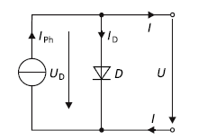
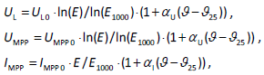
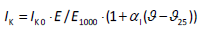
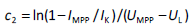

# Evalierungen des theoretsichen PV-Modells bezüglich ML
Das ultimative Ziel dieser Ausarbeitung ist es, zu analysieren, ob sich mithilfe theoretischer Modelle von PV-Anlagen ein neuronales Netz einlernen lässt. Hierbei sollen Fehler im Modell simuliert werden, um das Netz dann auf diese zu trainieren. So soll das neuronale Netz dann auch reale Fehler erkennen und einordnen können.

## Modellgrundlagen-Termin 1
Um die oben genannte Fragestellung überhaupt erst beantworten zu können, wird in diesem Teil der Ausarbeitung einleitend das Modell vorgestellt werden, mit dem die PV-Anlagen simuliert werden können/sollen. Dazu werden die folgenden Punkte vorgestellt:

- Halbleiter/Dioden-Aufbau
- Ein-Dioden-Modell 
- Zwei-Dioden-Modell
- Reihenschaltung von PV-Modulen

### Halbleiter/Dioden-Aufbau
Prinzipiell lassen sich Halbleiter ziemlich unaufwendig gut leitfähig machen. Die liegt daran, dass die Energiedifferenz zwischen dem Valenz- und dem Leitungsband raltiv gering ist. In der Regel ist die Rede von einer Energie von weniger als 5 eV. Dementsprechend können Elektronen durch Erregung durch externe Energiequellen leicht in einen Zustand höherer Energie versetzt werden, das heißt in das Valenzband wechseln. 

Dies ist hier einmal exemplarisch für das Beispiel von Silizium als Halbleiter dargestellt:

Durch die Energie in Form von Wärme oder Licht, werden Elektronen aus den Elektronenpaarbindungen herausgelöst und gehen von dem Valenzband in das Leitungsband über. Damit bilden sich frei bewegliche Ladungsträger in der Kristallstruktur aus , das heißt "positive Ladungsträger" (Löchern) und negative Ladungsträger (die freien Elektronen). 

Bringt man jetzt zwei unterschiedliche dotierte Halbleiter zusammen, das heißt Halbleiter, bei denen diese Löcher beziehungsweise die freien Elektronen durch das Einbringen von Fremdelementen künstlich erschaffen wurden, 

so bildet sich aufgrund des Potentialunterschied zwischen den beidnen Halbleitervariationen eine Spannung/ein elektrische Feld aus, welches eine Verschiebung der Löcher beziehungsweise der Elektronen hervorbringt. Die Löcher wandern in das n-dotierte Gebiet und die Elektronen in p-dotierte Gebiet. Dadurch ensteht eine sogennante Raumladungszone, in der keine freien Ladungsträger zu Verfügung stehen, diese befinden sich dort also im Valenzband. 

Durch diese Ladungsverschiebung bildet sich widerrum ein neues elektrisches Feld aus, welches dem Initialem entgegenwirkt. Der Drift der Ladungsträger findet also solange statt, bis sich beide elektrische Felder ausgleichen beziehungsweise die Gesamtspannung in Addition 0 ergibt. 

Durch das Zuführen von Energie ist es jedoch möglich die Elektronen in der Raumladungszone vom Valenzband in das Leitungsband anzuheben. Im Falle des PV-Moduls würde diese Energie in Form von Photonen hinzugefügt. Die Energie eines Photons beträgt hierbei:

 Dadurch sind in der Raumladungszone wieder freie Ladungsträger zu Verfügung und es findet ein Elektronenfluss ensprechend der Feldrichtung des elektrischen Feldes der Raumladungszone statt. Schließt man von außen nun einen elektrischen Verbraucher an das Modul an, so wird dieser von dem entstehenden Strom gespeist. 

---

### Ein-Dioden-Modell 
Vereinfachter Aufbau eines PV-Moduls:

Da es sich bei einem PV-Modul im Grunde genommen aus physikalischer Sicht um eine Diode handelt, kann zur einfachen Modellierung dieses Bauteils das angeführte Ersatzschaltbild verwendet werden. Dies gilt nur, sofern das PV-Modul rein als Erzeuger betrachter wird.

Aus den Kirchhoffschen Gesetzen berechnet sich gemäß der Knotenregel die Ausgangskennlinie eines PV-Moduls nach diesem ESB mit dem Ausdruck.

*IPh* ist dabei der Photostrom, der direkt proportional zur Bestrahlungsstärke E ist. 

Is ist der Sättigungsstrom der Diode in Sperrrichtung, dieser liegt bei Silizium-Dioden in der Regel im Bereich von 10−10 A. Der Parameter m beschreibt den sogenannten Diodenfaktor, welcher angeben soll, in welcher Form Rekombinationsmechanismen bei verschiedenen Temperaturen innerhalb des Halbleiters auftreten.
    

Schlussendlich lässt sich sagen, dass *Ut* als Temperaturspannung bezeichnet wird, die nach dem Zusammenhang 

ca. 25,7 mV bei 25 °C beträgt. 

Eine typische Ausgangskennlinie für dieses Modell hat diesen Verlauf:

---

### Zwei-Dioden-Modell 

In den meisten Fällen reicht das zuvor genannte Modell aus, um ein PV-Modul zu modellieren. Möchte man das zuvor genannte Modell weiterhin genauer auf den realen Sachverhalt abbilden, lässt sich dieses noch durch zusätzliche Bauteile erweitern. Dabei handelt es sich um eine zweite Diode, welche parallel zu der ersten geschaltet wird, einen Serienwiderstand      *Rs*, welcher die ohmschen Verluste der Zuleitung abbilden soll und einen weiteren Parallelwiderstand *Rp* zu den Dioden, welcher die Leckverluste abbildet. Das Ersatzschaltbild sieht dann wie folgt aus.

Die Ausgangskennlinie kann dann wieder einfach aus den Kirchhoffschen-Gesetzen abgeleitet werden (Knotenregel).

Die beiden Widerstände wirken sich wie folgt auf die Kennlinie aus.

---

### Reihenschaltung von PV-Modulen

Für den realen Sachverhalt des Projektes muss allerdings eine Reihenschaltung von PV-Modulen betrachtet werden. Nachdem zuvor schon Modelle zur Modellierung eines einzelnen PV-Moduls vorgestellt wurden, wird dementprechend in diesem Abschnitt grundlegend vorgestellt, wie der reale Sachverhalt bezüglich der Reihenschaltung von PV-Modulen hergeleitet werden kann.
Dazu wird zunächst nur ein Modell für den Spezialfall thematisiert, dass alle PV-Module als homogen betrachtet werden können. Das heißt also mehr oder weniger der Regulärbetrieb, wenn keines der Module sich in einem Fehlerzustand befindet. Im späteren Verlauf kann dann auf den Erkenntnissen mit diesem Modell aufgebaut werden und komplexere Ansätze erarbeitet werden. 

Zu Beginn sei anzumerken, dass sich die Modulspannung der einzelnen Komponenten in Reihe aufaddiert, der Gesamtstrom entspricht dem eines Einzelmoduls. 

Gleicher Strom:

   

Aufaddierte Spannung:

Die resultierende Kennlinie aus den genannten Effekten ergibt sich dann wie folgt:

Da die Größen aus den zuvor genannten Modellen zur Mehrzahl Theoriegrößen sind, welches sich in der Praxis kaum realistisch bestimmen lassen, versucht man den Sachverhalt der Reihenschaltung von PV-Anlagen auf möglichst einfache angebbare Herstellergrößen herunterzubrechen, aus welchen sich dann ziemlich simpel die Kennlinie für den momentanen Sachverhalt berechnen lässt. Das bedeutet für die aktuelle Beleuchtungsstärke sowie die Modultemperatur. 

Diese Herstellergrößen sind meist auf STC-Fall (standard test conditions) bezogen, welcher eine Beleuchtungsstärke von 1000 W/m2 und eine Temperatur von 25 °C vorraussetzen. Die spezifischen Parameter ergeben sich dann zu 

ergeben. Die Anzahl der PV-Module steckt dabei in *UL* beziehungsweise *UMPP* aufgrund der Spannungsaddition in Reihe. Weiterhin wissenswert ist, dass der Photostrom näherungsweise mit dem Kurzschlusstrom des Moduls gleichgesetzt werden und dass die MPP-Größen sich auf den Punkt des maximalen Leistungsflusses von Erzeuger zu Verbraucher beziehen (Widerstandsanpassung/Reflexionminimierung).

Die Kennlinie für eine Reihenschaltung von PV-Modulen kann dann durch den Ausdruck 

mit 

 

und 

in guter Näherung beschrieben werden.

---

### Zielstellung

Mit den erarbeiteten Grundlagen soll zunächst einmal ein Grundverständnis bezüglich PV-Modulen/Anlagen geschaffen werden. Ferner soll überprüft werden, ob sich mit dem beschriebenen Modell der Reihenschaltung von PV-Anlagen ein neuronales Netz so trainieren lassen kann, dass dieses bei gegebenen realen Fällen zwischen Fehlerfall und Regulärbetrieb unterscheiden kann. Sofern dies glückt, muss sich näher mit dem Modell beschäftigt werden, welches inhomogene Zustände von einzelnen PV-Modulen zulässt, um zunächst auf theoretischer Basis Fehlerursachen modellieren zu können. Im nächsten Schritt könnte dann das neuronale Netz ebenfalls wieder mit diesen Daten trainiert werden, um dann schlussendlich Fehlerursachen zu erkennen.

---
