# Interdisziplinäre Grundlagen zum Projektthema

## Einleitung

Die Solartechnik existiert bereits seit 1953 und wurde in den Bell Laboratories entwickelt. Photovoltaik(PV)-Anlagen haben in der Vergangenheit immer mehr Bedeutung erlangt. Energiewende, erneuerbare Energien und grüner Strom sind nur einige der Begriffe, die überall zu hören sind. 
Laut Fraunhofer Institut leisten PV-Anlagen einen wichtigen Beitrag zum Klimaschutz. Insbesondere durch relevante Beiträge zur Senkung des CO2-Ausstoßes. Dies berücksichtigt auch die Herstellung und Entsorgung der Anlage, da während des Betriebs kein CO2 ausgestoßen wird [WIRTH21]. Je länger eine PV-Anlage wirtschaftlich arbeiten kann, desto besser sind also die Auswirkungen auf die Umwelt, neben der Ersparnis, die Anlage zu erneuern. Um sicher zu stellen, dass PV-Anlagen fehlerfrei (im Rahmen des Möglichen) funktionieren müssen sie regelmäßig gewartet werden. Wartungen sind zeitaufwändig und damit teuer. Gleiches gilt für die Fehlersuche. Wenn diese manuell durchgeführt wird müssen die gesammelten Daten händisch ausgewertet werden. Dafür sind Experten nötig, welche ebenfalls teuer sind.

Das grundlegende Ziel dieses Projektes ist die Fehlererkennung an PV-Modulen mit Methoden des maschinellen Lernens. Dabei können sowohl gemessene als auch simulierte Daten sowie eine Reihe von Software-Tools und Methoden zum Einsatz kommen. Im weiteren soll daher ein Überblick der, für dieses Projekt relevanten, Themen gegeben werden.

## Grundlagen der Photovoltaik

PV-Anlagen sind der Untersuchungsgegenstand dieses Projekts. Daher erfolgt hier zunächst ein Überblick der Funktionsweise, des Aufbaus und der theoretischen Modellierung von PV-Modulen.

### Technik und Funktion

PV-Module basieren auf Halbleitern, d.h. Materialien welche nur unter bestimmten Umständen elektrisch leitend sind. Für PV-Module wird vorrangig Silizium eingesetzt. Die Stromerzeugung im Halbleiter basiert auf zwei physikalischen Prozessen. Der Erste ist der *innere Photoeffekt*, bei welchem durch das Auftreffen von Photonen auf der Halbleiterschicht Elektronen aus ihr herausgelöst werden. Dadurch verbleiben im Halbleiter das negativ geladene Elektron und ein positiv geladenes 'Loch'. Da beide frei beweglich sind ist die erste Voraussetzung für den Fluss elektrischen Stromes erfüllt. Allerdings würden sich die freien Elektronen und Löcher unter normalen Umständen schnell wieder vereinen. Dies wird durch den speziellen Aufbau des PV-Moduls (siehe Abbildung) verhindert.

Eingeschlossen zwischen positiver und negativer Elektrode befindet sich das Halbleitermaterial. Es handelt sich hierbei um Material, in welches Fremdatome eingefügt wurden (Dotierung). In der Praxis sind dies in der Regel Bor und Phosphor. Das dotierte Halbleitermaterial besteht aus zwei Schichten. eine p-dotierte Lage (in der Abbildung unten) in der ein Überschuss an positiven Löchern vorherrscht und eine n-dotierte Lage (in der Abbildung oben), in welcher sich mehr Elektronen befinden. Zwischen beiden Schichten befindet sich der pn-Übergang in dem sich Löcher aus der p-Lage mit Elektronen aus der n-Lage vereinen. Dadurch entsteht eine Grenzschicht, die den freien Fluss von Ladungsträgern verhindert und noch der Weg über den Verbraucher bleibt.

### Arten von Photovoltaik-Modulen
Es gibt verschiedene Arten von PV-Modulen, welche alle die selben grundlegenden Eigenschaften besitzen. Das Trägermaterial aller Module ist Glas. Dieses wird mit den photoaktiven Halbleitern beschichtet, welche für die tatsächliche Energieerzeugung verantwortlich sind. Dabei handelt es sich in der Regel um Siliziumzellen. Hierauf wird in den folgenden Abschnitten im Detail eingegangen. Ein PV-Modul ist aus vielen einzelnen Zellen aufgebaut, welche zu Strings zusammengeschaltet werden. Zum Schutz vor Fehlern werden einzelne Strings mit Schutzdioden überbrückt. 

Der Wirkungsgrad von PV-Modulen unterscheidet sich stark zwischen den einzelnen Typen. Er hat sich jedoch bei jedem Typ in den letzten 50 Jahren stark verbessert. In der folgenden Übersicht ist der Verlauf des Wirkungsgrades für verschiedene PV-Modul-Typen über die letzten Jahre dargestellt.

Etwas leichter zu lesen sind die aktuellen Werte:

| Zelltyp           | Wirkungsgrad |
| ----------------- | ------------ |
| monokristallin    | 20 - 22 %    |
| polykristallin    | 15 - 20 %    |
| amorphes Silicium | ~8 %         |
| CIS-Zellen        | ~12 %        |
| GaAS-Zellen       | ~25 %        |
| Farbstoffzellen   | 2 - 3 %      |

#### Monokristalline Silicium PV-Module
Monokristalline PV-Module werden aus Silicium hergestellt. Dafür wird Silicium geschmolzen und gereinigt. Aus dem geschmolzenen Silicium wird ein einziger Monokristalliner Stab gezogen, welcher ein einheitliches Kristallgitter aufweist. Der Stab wird dann in sehr dünne Scheiben (Wafer) gesägt. Diese sind nur einige Mikrometer dick. Bereits während der Wafer-Herstellung wird das Silicium mit Bor dotiert und chemisch behandelt. Die andere Hälfte der Wafer wird dann mit Phosphor dotiert. Die Solarzelle wird aus den behandelten und dotierten Wafern aufgebaut. Jede Zelle enthält einen n- und einen p-dotierten Wafer. Monokristalline PV-Module haben einen hohen Wirkungsgrad, sind dafür aber sehr aufwändig in der Herstellung und dadurch teuer. Hinzukommt, dass die energetische Amortisationsdauer durch die aufwändige Herstellung höher ist.

#### Multikristalline Silicium PV-Module
Genau wie Monokristalline PV-Module bestehen Multi- oder Polykristalline PV-Module aus dem Grundstoff Silicium. Dieses wird bei der Herstellung der Module zunächst gereinigt und dann für die Weiterverarbeitung geschmolzen. Es gibt verschiedene Fertigungsmethoden:
- Gießverfahren: das geschmolzene Silicium wird in Tiegel gegossen und kühlt in diesen ab, wobei sich Kristalle bilden
- Bridgeman-Verfahren: Das Silicium kühlt im selben Tiegel ab, in dem es erhitzt wurde. Es wird dann in Wafer zersägt und weiterverarbeitet

Bei beiden Verfahren entstehen mehrere Kristalle. Die Verfahren sind sehr viel einfacher und günstiger als das Herstellen von Monokristallinen Modulen. Das führt zu einem hohen Preis-Leistungs-Verhältnis und zu einem hohen Marktanteil (>80% in Deutschland). Der Wirkungsgrad ist jedoch geringer.

#### Amorphe Silicium PV-Module
Amorphe Solarzellen, oder auch Dünnschicht-PV-Module sind nicht kristallin. Das Material (i.d.R. Silizium) wird bei der Herstellung auf eine Trägerschicht aufgedampft oder aufgedruckt. Dadurch entsteht eine nicht-kristalline Schicht, so wie in der folgenden Abbildung dargestellt.

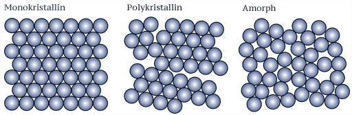

Amorphe PV-Module sind materialsparend und günstig. Dies kann durch den hohen Absorptionsgrad des Halbleitermaterials erzielt werden. Sie können in sehr dünnen Schichten effizient Energie erzeugen.
Ein weiterer Vorteil der dicke ist die Formbarkeit der PV-Module. Sie ermöglicht viele neue Anwendungsbereiche, wie aufrollbare oder mobile PV-Module. Der Wirkungsgrad von Amorphen PV-Modulen ist allerdings gering. Dafür können Sie sehr gut mit Verschattungen umgehen.

#### Mikromorphe Silicium PV-Module
Das Ziel mikromorpher PV-Module ist es, einen höheren Wirkungsgrad zu erzielen, als mit Amorphen Silicium Modulen. Bei dieser Technik werden Zellen mit Silizium unterschiedlicher Struktur hintereinander geschaltet. Die Kombination einer amorphen mit einer mikrokristallinen Zelle wird dann als mikromorphe Zelle bezeichnet. Diese Zellentyp ist eine Weiterentwicklung und Optimierung der Tandemzelle aus amorphem Silizium.

#### CdTe PV-Module 

CdTe Solarzellen (cadmium telluride) sind eine vielgenutzte Alternativen zu Silizium-Modulen. Sie sind sehr dünn und können einfach und günstig produziert werden. mit ca. 22% Wirkungsgrad sind sie sehr effektiv. Ein weiterer positiver Aspekt der Zelle ist der hohe Absorptionsgrad des Materials.
Die meisten CdTe Solarzellen bestehen aus einem pn-Übergang mit einem p-dotierten CdTe-Layer und einem n-dotierten CdS- (Cadmium Sulfid) oder MZO- (Magnesium Zinkoxid) Layer. Typische CdTe-Dünnschichtabscheidungstechniken sind die Dampftransportabscheidung und die Sublimation. CdTe-Absorberschichten werden in der Regel auf einer transparenten leitfähigen Oxidschicht (TCO) aufgebracht - in der Regel fluordotiertes Zinnoxid (SnO2:F). Die Zellen werden mit einem elektrischen Rückseitenkontakt vervollständigt - typischerweise eine Schicht aus Zink-Tellurid (ZnTe), gefolgt von einer Metallschicht oder einer Kohlenstoffpaste, die auch Kupfer (Cu) in die Rückseite der Zelle einbringt.

#### CIGS PV-Module
Kupfer Indium Gallium Diselenid (CIGS) PV-Module sind Dünnschicht-Module mit einer Dicke von 1-2 Mikrometern. Der Absorptionskoeffizient ist sehr hoch, wodurch die dicke der Schicht sehr klein sein kann. Dadurch sind CIGS-PV-Module sehr Materialsparend. Mit fortlaufender Entwicklung ist der Wirkungsgrad der Technologie immer weiter gestiegen und hat mittlerweile ~24% erreicht. Problematisch ist die Herstellung in Massenproduktion, da der Rohstoff Indium knapp ist, sowie die Entsorgung aufgrund des toxischen Materials.

### Aufbau einer PV-Anlage
PV-Anlagen haben viele Bestandteile. Die wichtigsten davon sind die PV-Module und der Wechselrichter. Hinzu kommt selbstverständlich Messausrüstung, Überwachungseinrichtungen, Gerüste, usw. Die einzelnen PV-Module werden zu Strings zusammengeschaltet. Dadurch wird die erzeugte Spannung erhöht. Je nach Anlange gibt es eine variable Anzahl an Strings mit einer wiederum variablen Anzahl an PV-Modulen. Alle Strings werden an einen Wechselrichter angeschlossen, dessen genaue Funktion im Abschnitt [Wechselrichter](#wechselrichter) erklärt wird. 

### Wechselrichter
Die grundlegende Aufgabe eines Wechselrichters ist es Gleichstrom (**D**irect **C**urrent) in Wechselstrom (**A**lternating **C**urrent) umzuwandeln. Nach der Umwandlung kann die von der PV-Anlage erzeugte Energie in das Stromnetz eingespeist und verwendet werden. Der Wechselrichter hat selbst einen bestimmten Wirkungsgrad, der sehr hoch sein muss (>99,5%).
Der Wechselrichter ist außerdem dafür Zuständig die Anlage mit bestmöglicher Effizienz zu betreiben. Dieser Betriebspunkt heißt Maximum Power Point (MPP). Am Wechselrichter können außerdem Daten aufgenommen und einfache Fehler ermittelt werden.

### Leistung

Die primäre Kennzahl einer PV-Anlage ist die erzeugte Leistung. Jede einzelne Solarzelle erzeugt eine Leistung auf einer bestimmten Spannung (z.B. 0,5V). Einzelne Solarzellen werden in Reihe zu Strings zusammen geschaltet um die Endspannung zu erhöhen (z.B. 50 Solarzellen * 0,5V = 25V). Der  Leistungsverlauf einer Anlage ist sowohl von internen als auch externen Faktoren abhängig, die im weiteren erläutert werden.

#### Sonneneinstrahlung
Die Sonneneinstrahlung ist der primäre Faktor, welcher die Leistung eines Moduls bestimmt. Es ist klar zu erkennen, dass die erzeugte Energie an einem Sonnentag höher ist, als an Tagen an denen die Sonne nicht scheint. Dabei ist der Energieertrag rund um die Mittagszeit am höchsten.

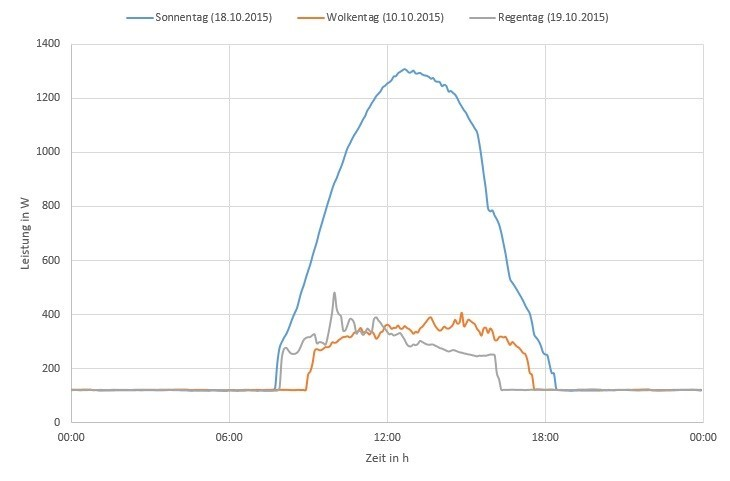

#### Temperatur
Die Leistungsabgabe von PV-Modulen ist temperaturabhängig. Je niedriger die Temperatur ist, desto höher ist der Leistungsertrag. Dieser Zusammenhang ist linear.

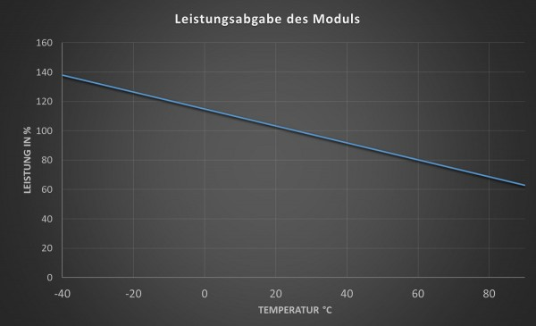

#### Jahres- und Tagesverlauf
Über das Jahr verteilt kann mit PV-Anlagen eine sehr unterschiedliche Energiemenge erzeugt werden. Das Datum muss daher ebenfalls betrachtet werden, wenn ein Leistungsverlauf untersucht wird.

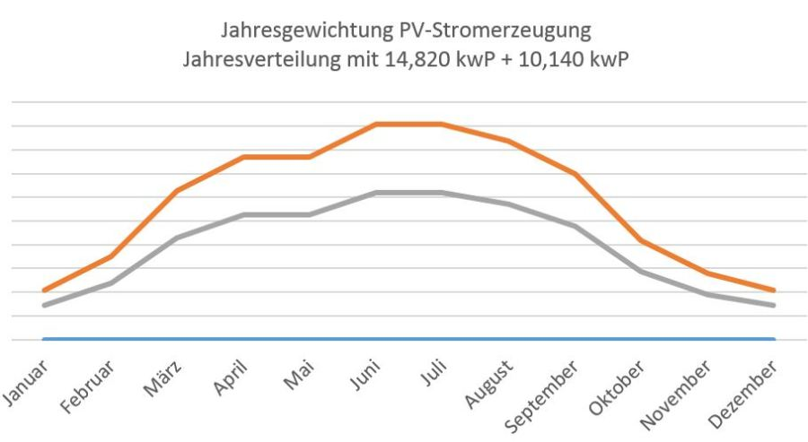

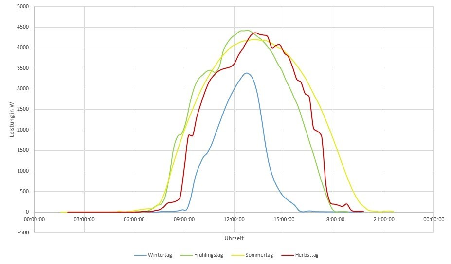

#### Ort
Der Ort, an welchem sich die PV-Anlage befindet spielt indirekt eine Rolle, da die klimatischen Bedingungen an den Ort gekoppelt sind.

#### Neigung
Der Auftrittswinkel der Sonnenstrahlen auf dem PV-Modul ist ausschlaggebend bezüglich der Leistungserzeugung. Je näher der Winkel an 90° ist, desto höher ist der Wirkungsgrad. Es kann sinnvoll sein, den Winkel eines PV-Moduls im Laufe eines Tages/Jahres zu verändern.

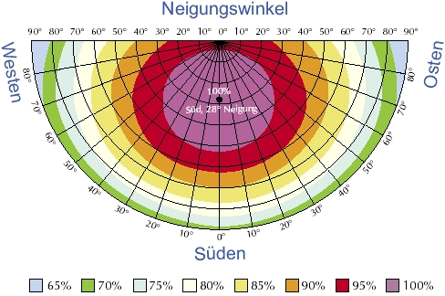

###Modulfehler

Von Fehlern betroffene Zelle produzieren zum einen proportional zur fehlenden Fläche weniger Strom, zum Anderen beeinflusst dies die Leistung des gesamten Strings. Je nach Größe des abgetrennten Bereichs kann dies zum Abschalten eines Modulteilstrings über die Bypass-Diode führen.

####Fehlerarten

Konstante Fehler:
- Verschmutzung: PV-Anlagen verschmutzen mit der Zeit, insbesondere in Gebieten, in denen es nicht häufig regnet oder wenn die PV-Module einen flachen Aufstellwinkel haben (<10°). Insbesondere Laubabwurf und Staubquellen können zu Verschmutzung führen. [WIRTH21]
- Verschattung
- Leistungsnachlass, Degradierung: PV-Module degradieren mit der Zeit. Das bedeutet, dass die abgegebene Leistung nachlässt. Dieser Vorgang geschieht mit einem jährlichen Leistungsverlust von 0,15% und ist damit so gering, dass er in diesem Projekt keine Auswirkung auf die Analyse der Fehler hat. [WIRTH21]

Sporadische Fehler
- Stromausfall
- Glasbruch
- Zellbruch
- Kurzschluss an Dioden
- Isolierung Fehlerhaft
- Schlag-Störung
- Schnee
- Verschmutzung

Folgefehler
- Hotspots (nach Verschmutzung oder Verschattung)

#### Fehlererkennung

Defekte an PV-Anlagen haben verschiedene Auswirkungen und können daher auf mehrere Arten ausgewertet werden. Ein Verfahren ist z.B. die Thermografie. *Das Verfahren beruht darauf, dass Defekte in Solarmodulen lokal den elektrischen Widerstand erhöhen und somit zu einer Wärmeentwicklung führen. Daher sind defekte Stellen auf Wärmebildern im Allgemeinen gut zu erkennen.
Die Thermografie kann sowohl Risse in den Zellen als auch Verunreinigungen oder Schäden der Glasabdeckung sichtbar machen. In beiden Fällen beruht der Effekt auf einer lokalen Erhöhung des elektrischen Widerstands. Im Fall einer Beschädigung oder eines Produktionsfehlers des Moduls ist der Zusammenhang relativ offensichtlich. Aber auch eine eng lokalisierte Verschattung hat diesen Effekt, weil der Widerstand in verdunkelten Bereichen der Zelle deutlich höher ist.* [photovoltaik.org](https://www.photovoltaik.org/photovoltaikanlagen)

Das Thermografie-Verfahren erfordert aber eine Beobachtung der PV-Module mit Wärmebildkameras, was für den Betrieb einer Anlage zusätzlichen technischen und finanziellen Aufwand bedingt, so dass diese Daten, wenn überhaupt, nicht kontinuierlich verfügbar sind. Für das vorliegende Projekt soll daher das Zeit-Leistungs-Verhalten von PV-Anlagen untersucht werden. Die Herausforderung ist dabei die Auswirkungen von Fehlern von anderen Einflüssen zu unterscheiden.

###Theoretische Modellierung von PV-Anlagen

#### Halbleiter/Dioden-Aufbau
Prinzipiell lassen sich Halbleiter mit wenig Aufwand leitfähig machen. Die liegt daran, dass die Energiedifferenz zwischen dem Valenz- und dem Leitungsband relativ gering ist. In der Regel ist die Rede von einer Energie von weniger als 5 eV. Dementsprechend können Elektronen durch Erregung durch externe Energiequellen leicht in einen Zustand höherer Energie versetzt werden, das heißt in das Valenzband wechseln. 

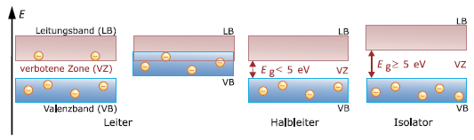

Dies ist hier einmal exemplarisch für das Beispiel von Silizium als Halbleiter dargestellt:

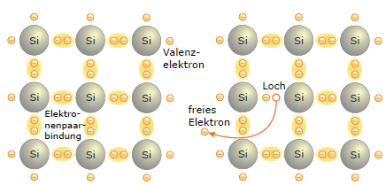

Durch die Energie in Form von Wärme oder Licht, werden Elektronen aus den Elektronenpaarbindungen herausgelöst und gehen von dem Valenzband in das Leitungsband über. Damit bilden sich frei bewegliche Ladungsträger in der Kristallstruktur aus , das heißt "positive Ladungsträger" (Löchern) und negative Ladungsträger (die freien Elektronen). 

Bringt man jetzt zwei unterschiedliche dotierte Halbleiter zusammen, das heißt Halbleiter, bei denen diese Löcher beziehungsweise die freien Elektronen durch das Einbringen von Fremdelementen künstlich erschaffen wurden, 

so bildet sich aufgrund des Potentialunterschied zwischen den beiden Halbleitervariationen eine Spannung/ein elektrische Feld aus, welches eine Verschiebung der Löcher beziehungsweise der Elektronen hervorbringt. Die Löcher wandern in das n-dotierte Gebiet und die Elektronen in p-dotierte Gebiet. Dadurch entsteht eine sogenannte Raumladungszone, in der keine freien Ladungsträger zu Verfügung stehen, diese befinden sich dort also im Valenzband. 

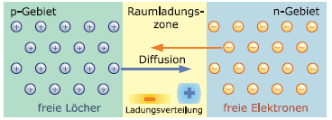

Durch diese Ladungsverschiebung bildet sich wiederum ein neues elektrisches Feld aus, welches dem Initialem entgegenwirkt. Der Drift der Ladungsträger findet also solange statt, bis sich beide elektrische Felder ausgleichen beziehungsweise die Gesamtspannung in Addition 0 ergibt. 

Durch das Zuführen von Energie ist es jedoch möglich die Elektronen in der Raumladungszone vom Valenzband in das Leitungsband anzuheben. Im Falle des PV-Moduls würde diese Energie in Form von Photonen hinzugefügt. Die Energie eines Photons beträgt hierbei:

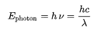

 Dadurch sind in der Raumladungszone wieder freie Ladungsträger zu Verfügung und es findet ein Elektronenfluss entsprechend der Feldrichtung des elektrischen Feldes der Raumladungszone statt. Schließt man von außen nun einen elektrischen Verbraucher an das Modul an, so wird dieser von dem entstehenden Strom gespeist. 

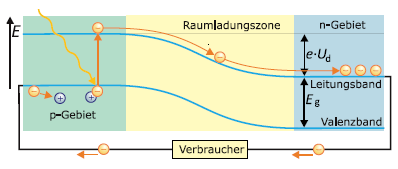

---

### Ein-Dioden-Modell 
Da es sich bei einem PV-Modul im Grunde genommen aus physikalischer Sicht um eine Diode handelt, kann zur einfachen Modellierung dieses Bauteils das angeführte Ersatzschaltbild verwendet werden. Dies gilt nur, sofern das PV-Modul rein als Erzeuger betrachtet wird.

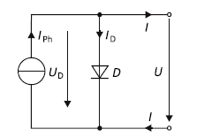

Aus den Kirchhoffschen-Gesetzen berechnet sich gemäß der Knotenregel die Ausgangskennlinie eines PV-Moduls nach diesem ESB mit dem Ausdruck.

*IPh* ist dabei der Photostrom, der direkt proportional zur Bestrahlungsstärke E ist. 

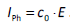

Is ist der Sättigungsstrom der Diode in Sperrrichtung, dieser liegt bei Silizium-Dioden in der Regel im Bereich von 10−10 A. Der Parameter m beschreibt den sogenannten Diodenfaktor, welcher angeben soll, in welcher Form Rekombinationsmechanismen bei verschiedenen Temperaturen innerhalb des Halbleiters auftreten.
    

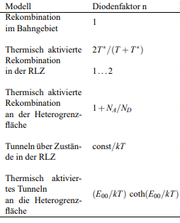

Schlussendlich lässt sich sagen, dass *Ut* als Temperaturspannung bezeichnet wird, die nach dem Zusammenhang 

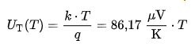

etwa 25,7 mV bei 25 °C beträgt. 

Eine typische Ausgangskennlinie für dieses Modell hat diesen Verlauf:

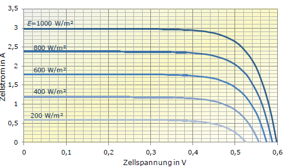

---

### Zwei-Dioden-Modell 

In den meisten Fällen reicht das zuvor genannte Modell aus, um ein PV-Modul zu modellieren. Möchte man das zuvor genannte Modell weiterhin genauer auf den realen Sachverhalt abbilden, lässt sich dieses noch durch zusätzliche Bauteile erweitern. Dabei handelt es sich um eine zweite Diode, welche parallel zu der ersten geschaltet wird, einen Serienwiderstand      *Rs*, welcher die ohmschen Verluste der Zuleitung abbilden soll und einen weiteren Parallelwiderstand *Rp* zu den Dioden, welcher die Leckverluste abbildet. Das Ersatzschaltbild sieht dann wie folgt aus.

Die Ausgangskennlinie kann dann wieder einfach aus den Kirchhoffschen-Gesetzen abgeleitet werden (Knotenregel).

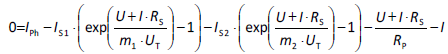

Die beiden Widerstände wirken sich wie folgt auf die Kennlinie aus.

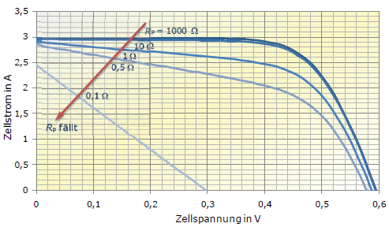

---

### Reihenschaltung von PV-Modulen

Für den realen Sachverhalt des Projektes muss allerdings eine Reihenschaltung von PV-Modulen betrachtet werden. Nachdem zuvor schon Modelle zur Modellierung eines einzelnen PV-Moduls vorgestellt wurden, wird dem­ent­spre­chend in diesem Abschnitt grundlegend vorgestellt, wie der reale Sachverhalt bezüglich der Reihenschaltung von PV-Modulen hergeleitet werden kann.
Dazu wird zunächst nur ein Modell für den Spezialfall thematisiert, dass alle PV-Module als homogen betrachtet werden können. Das heißt also mehr oder weniger der Regulärbetrieb, wenn keines der Module sich in einem Fehlerzustand befindet. Im späteren Verlauf kann dann auf den Erkenntnissen mit diesem Modell aufgebaut werden und komplexere Ansätze erarbeitet werden. 

Zu Beginn sei anzumerken, dass sich die Modulspannung der einzelnen Komponenten in Reihe aufaddiert, der Gesamtstrom entspricht dem eines Einzelmoduls. 

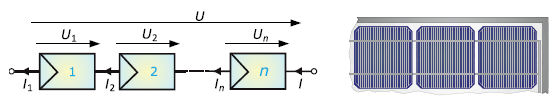

Gleicher Strom:

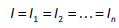   

Aufaddierte Spannung:

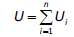

Die resultierende Kennlinie aus den genannten Effekten ergibt sich dann wie folgt:

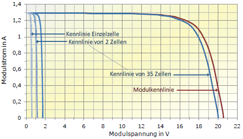

Da die Größen aus den zuvor genannten Modellen zur Mehrzahl Theoriegrößen sind, welches sich in der Praxis kaum realistisch bestimmen lassen, versucht man den Sachverhalt der Reihenschaltung von PV-Anlagen auf möglichst einfache angebbare Herstellergrößen herunterzubrechen, aus welchen sich dann ziemlich simpel die Kennlinie für den momentanen Sachverhalt berechnen lässt. Das bedeutet für die aktuelle Beleuchtungsstärke sowie die Modultemperatur. 

Diese Herstellergrößen sind meist auf STC-Fall (standard test conditions) bezogen, welcher eine Beleuchtungsstärke von 1000 W/m2 und eine Temperatur von 25 °C voraussetzen. Die spezifischen Parameter ergeben sich dann zu 

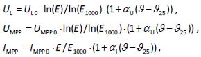

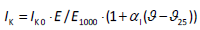

ergeben. Die Anzahl der PV-Module steckt dabei in *UL* beziehungsweise *UMPP* aufgrund der Spannungsaddition in Reihe. Weiterhin wissenswert ist, dass der Photostrom näherungsweise mit dem Kurzschlusstrom des Moduls gleichgesetzt werden und dass die MPP-Größen sich auf den Punkt des maximalen Leistungsflusses von Erzeuger zu Verbraucher beziehen (Widerstandsanpassung/Reflexionminimierung).

Die Kennlinie für eine Reihenschaltung von PV-Modulen kann dann durch den Ausdruck 

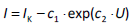

mit 

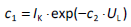 

und 

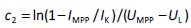

in guter Näherung beschrieben werden.

## Deep Learning

### Implizite Merkmalsextraktion durch neuronale Netze
Einen Teilbereich der künstlicher Intelligenz stellt das maschinelle Lernen dar. Hier erfolgt eine Mustererkennung nicht nach vorher festgelegten Regeln, sondern anhand intrinsischer Merkmale der Datenpunkte. Diese können im Fall des unüberwachten Lernens mittels einer definierten Ähnlichkeitsmetrik, wie z.B. des geometrischen Abstands, gruppiert werden. Beim überwachten Lernen findet in einer vorhergehenden Datenanalyse eine Klassifizierung der in dieser Phase vorkommenden Merkmale statt. Anschließend werden diese Klassen separiert und die daraus abgeleiteten Klassengrenzen für die Klassifizierung von Daten außerhalb der Trainingsphase verwendet.
Zur sinnvollen Trennung der Daten muss oft im Vorfeld eine Merkmalsextraktion und -selektion stattfinden, dies bedeutet, genau die Merkmale zu finden, die den Datensatz noch gut genug beschreiben und sinnvoll trennen. Merkmale, die eine geringe Repräsentation besitzen werden verworfen. Eine Anwendung des klassischen maschinellen Lernens geht dadurch bei multivarianten Daten oft mit einer manuellen Vorarbeit einher. Auf diese manuelle Merkmalsextraktion kann bei der Anwendung des tiefen Lernens verzichtet werden. Die beim tiefen Lernen angewandten Topologien neuronaler Netze ermöglichen eine implizite Merkmalsextraktion durch automatische Anpassung ihrer Parameter aufgrund von Trainingsdaten.

  * Mittels tiefer neuronaler Netze können Merkmale ohne vorherige Featureextraktion herausgebildet werden

### Neuronale Netze

#### McCulloch/Pitts Zelle
Der Beginn der Entwicklung künstlicher neuronaler Netze wird oft auf das 1943 von Warren McCulloch und Walter Pitts vorgestellte „künstliche Neuron“ datiert. Inspiriert von der damaligen Grundlagenforschung zu biologischen Neuronen stellt das „künstliche Neuron“ ein einfaches Modell dar, das die Signalweiterleitung im Gehirn simulieren soll. Dieses Neuron besteht aus mehreren Eingangsleitungen und einer Ausgangsleitung, die jeweils binäre Signale verarbeiten oder ausgeben können. Die Eingangsleitungen können dabei das Attribut „hemmend“ oder „bestärkend“ besitzen. Ist mindestens eine hemmende Eingangsleitung aktiv, wird der Ausgang des Neurons inaktiv geschaltet. Sind eine vorgegebene Menge an bestärkenden Eingangsleitungen aktiv, schaltet das Neuron den Ausgang aktiv. Durch Vernetzung mehrerer derartiger künstlicher Neuronen ist die Berechnung komplexer logischer Verknüpfungen möglich. Die Netze werden dann für die jeweilige Aufgabe im Vornherein parametriert, indem die hemmenden und bestärkenden Leitungen und die Schaltschwellen vorgegeben werden

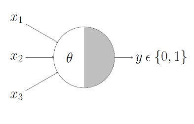

#### Multilayer Perzeptron
Im Jahre 1957 stellte Frank Rosenblatt das sogenannte Perzeptron als ein erweitertes Modell eines künstlichen Neurons vor. Die Signale sind hier nicht mehr binär, sondern können Zahlenwerte annehmen. Jede Eingangsleitung besitzt eine Gewichtung mit der die einzelnen Signalwerte multipliziert werden. Die Summe dieser gewichteten Werte wird als Eingabewert einer sogenannten Aktivierungsfunktion verwendet. Der Ausgabewert dieser Funktion ist der des Perzeptrons. Als Aktivierungsfunktion wird zum Beispiel die Heaviside-Funktion verwendet.

ℎ𝑒𝑎𝑣𝑖𝑠𝑖𝑑𝑒(𝑧)={
    0 𝑤𝑒𝑛𝑛 𝑧<0 
    1 𝑤𝑒𝑛𝑛 𝑧≥0
}

Durch Hintereinanderschaltung mehrerer paralleler Perzeptronen wurde die Basis moderner künstlicher neuronaler Netze gelegt. Die Topologie derartiger Netze besteht aus einer Eingabeschicht, die jedes Eingangssignal an jedes in der dahinterliegenden Schicht liegende Neuron weiterleitet. Auf diese Schicht können dann beliebig viele weitere Schichten gestapelt werden. Die letzte dieser Schichten wird als Ausgabeschicht bezeichnet, die zwischen dieser und der Eingabeschicht liegenden als verborgende Schichten. Liegt ein Netz mit insgesamt drei Schichten vor, wird dieses Netz als Multilayer Perzeptron bezeichnet. Erst 1986 wurde mit dem Backpropagation-Algorithmus und der Ersetzung der Heaviside-Aktivierungsfunktion mit einer stetig differenzierbaren Funktion die Möglichkeit gegeben neuronale Netze aufgrund von Daten zu trainieren

#### Tiefe neuronale Netze
Mit der Verwendung mehrerer verborgener Schichten nimmt die Abstraktionsfähigkeit des neuronalen Netzes zu. Dies liegt an der mit der Schichttiefe exponentiell steigenden Anzahl von Parametern, u.a. der Kantengewichte. Mittels dieser tiefen Schichten, bei denen sich die Anzahl der Neuronen pro Schicht für gewöhnlich verringern, sind komplexe Mustererkennungen, wie z.B. von Gesichtern möglich. Allerdings geht dieser Anstieg der Leistungsfähigkeit mit Problemen einher. Zum einen tritt beim Training mittels Backpropagation-Verfahren das Problem des explodierenden oder verschwindenden Gradienten auf. Wird ein Fehler von der Ausgabeschicht zur Eingabeschicht zurück propagiert, wird dieser immer kleiner. Im schlechtesten Fall werden die untersten Schichten gar nicht trainiert. Weiter besteht das Problem der Überanpassung. Je mehr Parameter das neuronale Netz besitzt, desto eher neigt es dazu, den Trainingsdatensatz als solches zu repräsentieren und nicht die Muster der Daten des Trainingssatzes zu extrahieren. Um einer Überanpassung zu entgehen, muss die Menge an Trainingsdaten größer werden. Damit steigt dann auch die Dauer des Trainings

#### Rekurrente neuronale Netze
Bei den bislang vorgestellten Netztopologien handelt es sich um Feed-Forward-Netze. Ein Eingabevektor wird hier durch das Netz bis zur Ausgabeschicht propagiert. Dies ist für statische Daten wie Bilder sinnvoll, es ermöglicht allerdings keine Einprägung zeitlicher Muster. Bei rekurrenten Netzen wird diese Abhängigkeit zeitlicher Muster durch die Einführung von rückwärts gerichteten Verbindungen innerhalb des Netzes erreicht. Im einfachsten Fall besteht ein derartiges Netz aus einem Neuron, das zum nächsten Zeitpunkt t zusätzlich zum neuen Eingabewert seine Ausgabe vom letzten Zeitpunkt t-1 erhält. Werden mehrere derartige Neuronen in einer Schicht kombiniert, erhalten diese neben einem neuen Eingabevektor die Ausgabe des letzten Ausführungszeitpunktes. Nachteil dieses einfachen Netzes ist, dass zeitliche Eingaben zu frühen Zeitpunkten aufgrund der andauernden Transformation mittels neuer Daten langsam „verblassen“. Die Netztopologie besitzt damit kein Langzeitgedächtnis. Komplexere Zellen, wie die LSTM-Zelle oder GRU-Zelle verringern dieses Problem. Die Long-Short-Term Memory-Zelle (LSTM) besitzt so zwei Zustandsvektoren, von denen der eine die kurzfristigen Merkmale und der andere die längerfristigen Merkmale abspeichern soll

## Software

Im Rahmen des Projekts werden verschiedene Softwarelösungen und Bibliotheken zur Entwicklung von künstlichen neuronalen Netzen, zur Vorverarbeitung und Visualisierung der zur Verfügung stehenden Daten verwendet. Der Quellcode wird in der Programmiersprache Python 3 in Verbindung mit verschiedenen Bibliotheken geschrieben.

### Pandas

Pandas ist eine Bibliothek, die Hilfsmittel für die Datenanalyse und Datenverwaltung bereitstellt. Sie stellt Datenstrukturen und Operatoren für numerische Tabellen und Zeitreihen, die für das Aufbereiten der zu verarbeitenden Daten verwendet werden können. Außerdem bietet Pandas Funktionen zur Darstellung von Daten in verschiedenen Diagrammtypen.

### Keras

Keras ist eine Open Source Deep-Learning-Bibliothek, die in Python entwickelt wurde. Sie kann verschiedene Backend-Engines verwenden, darunter sind Tensorflow, Microsoft Cognitive Toolkit und Theano. Seit Tensorflow 1.4 ist Keras ein Teil der Tensorflow Core API, besteht aber weiterhin als eigenständige Bibliothek. Die Ausführung von Programmen mit Keras ist auf der CPU und GPU möglich.

#### Leitsätze von Keras
 - Modularität
   - Ein Modell wird als Graph oder Sequenz gesehen, bestehend aus eigenständigen konfigurierbaren Modulen
 - Minimalismus
   - Jedes Modell sollte so klein und so simple wie mögliche gehalten werden
 - Einfache Erweiterbarkeit
   - Einfaches hinzufügen von neuen Modellen
 - Arbeiten mit Python
   - Alle Funktionen von Keras sind mit Python verwendbar, es werden keine weiteren config-Dateien oder ähnliches benötigt

###Tensorflow

Tensorflow ist eine Open-Source Plattform die für die Entwicklung und Trainieren von Machine-Learning-Modellen verwendet werden kann. Die entwickelten Modelle können mit Tensorflow einfach auf verschiedene Plattformen veröffentlicht werden.
Im laufe des Projekts wird es als Backend-Engine für Keras verwendet. 

##Quellen

https://www.photovoltaik.org/photovoltaikanlagen

https://www.photovoltaik.org/wissen/photovoltaik-wirkungsgrad

https://www.photovoltaik4all.de/blog/welche-rolle-spielt-die-temperatur-einer-photovoltaikanlage

https://photovoltaiksolarstrom.com/photovoltaiklexikon/amorphe-solarzellen/

https://www.pv-ertrag.com/neigung-und-ausrichtung/

https://www.energynet.de/2013/01/14/liste-5-fehler-photovoltaikmodule/

https://photovoltaiksolarstrom.com/solarzelle-funktion/

https://www.photovoltaik-web.de/photovoltaik/module

https://faroit.com/keras-docs/1.2.0/  
https://www.tensorflow.org/learn?hl=en  
https://ipython.readthedocs.io/en/stable/  
https://pandas.pydata.org/  

[RAUSCH12] Lothar Rausch, Uwe R. Fritsche* Öko-Institut e.V.: Aktualisierung von Ökobilanzdaten für Erneuerbare Energien im Bereich Treibhausgase und Luftschadstoffe - Endbericht -; https://www.oeko.de/oekodoc/1621/2012-467-de.zip

[WIRTH21] Harry  Wirth, Aktuelle  Fakten  zur  Photovoltaik  in  Deutschland, Fraunhofer ISE, Download von www.pv-fakten.de, Fassung vom 30.04.2021

